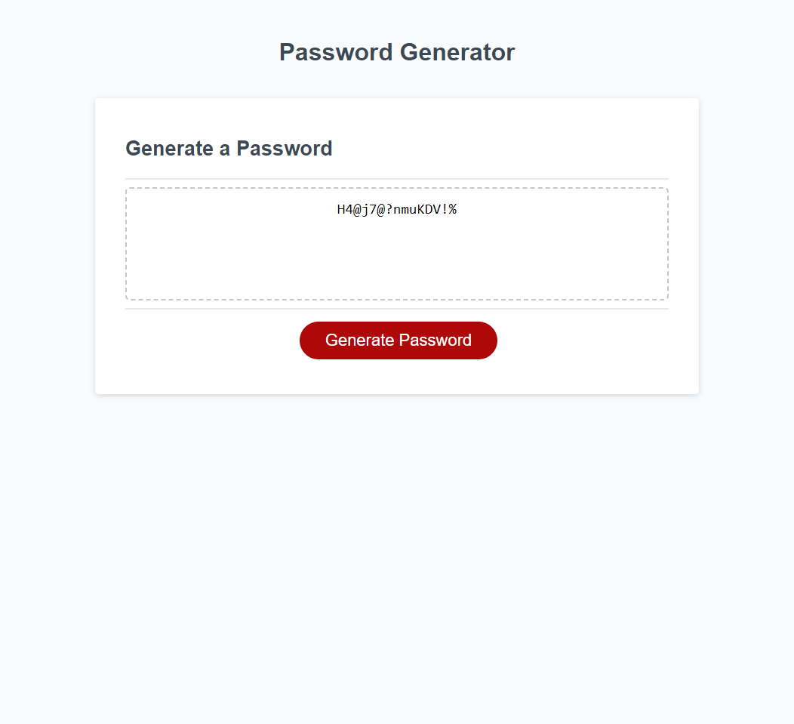

# 03 JavaScript: Password Generator - John Mabie

For this challenge I wasn't entirely sure to begin so I utilized office hours to get advice on:
1) How to create the proper arrays for each kind of character the password can utilize
2) How to combine or not combine those elements into a joint array depending on confirms
3) How best to approach possible errors with the user inputs

I utilized 4 separate arrays for each character types and set them up to concat into an empty array upon any confirms from the user. 

Then I built a long sequence of prompts, alerts and confirms to get the required length of the password and a selection of which characters to randomize. Using "IF" statements to prevent any non-numerical entry for password length and to assure the password remains between 8-128 characters in length, any incorrect inputs will give an alert as to what went wrong, return null, and force the user to restart. Similarly, using a "WHILE" statement, if no selections for character types are made by way of the confirms presented, an alert is given that at least one must be chosen, but does not return null / force user to restart the whole process, because at this point the user will have already entered a correct input for password length and we don't want them to lose their progress. 

Only once a correct password length and acceptable selections for the character choices have been made, will the generator finish the process and provide a randomized password. 

One possible issue I ran into, which I didn't see as a formal requirement in the original challenge README, is that I wasn't able to code the randomization to *guarantee* the inclusion of every selected character type into a randomized password. From my tests of the application, it would theoretically be possible to select all four character types and receive a randomized password with only three character types included, or select three character types and receive a password with only two, and so on. I hope this is something that is covered in future classes!

A screenshot of the application when opened in Default Browser (Google Chrome) can be seen below:

A link to the deployed application can be found below:
https://jmabie94.github.io/12-22-22-javascript-password-generator/
